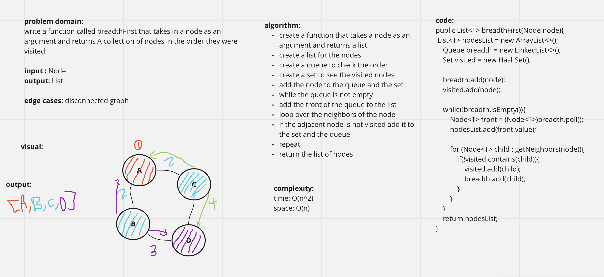

# Graphs
<!-- Short summary or background information -->
A Graph is a non-linear data structure consisting of nodes and edges. The nodes are sometimes also referred to as vertices and the edges are lines or arcs that connect any two nodes in the graph.

## Challenge
<!-- Description of the challenge -->
Implementing the graph, and should include the following methods:

- add node
- add edge
- get nodes
- size

## API
<!-- Description of each method publicly available in your Graph -->
- add node()  
Arguments: value
Returns: The added node
Add a node to the graph
- add edge()  
Arguments: 2 nodes to be connected by the edge,
Returns: nothing
Adds a new edge between two nodes in the graph
Both nodes should already be in the Graph
- get nodes()  
Arguments: none
Returns all of the nodes in the graph as a collection (set, list, or similar)
get neighbors
Arguments: node
Returns a collection of edges connected to the given node
Include the weight of the connection in the returned collection
- size()  
Arguments: none
Returns the total number of nodes in the graph


# Challenge Summary
<!-- Description of the challenge -->
write a function called breadthFirst that takes in a node as an argument and returns A collection of nodes in the order they were visited.

## Whiteboard Process
<!-- Embedded whiteboard image -->


## Approach & Efficiency
<!-- What approach did you take? Why? What is the Big O space/time for this approach? -->
complexity:  
time: O(n^2)  
space: O(n)

## Solution
<!-- Show how to run your code, and examples of it in action -->

```java
Graph graph = new Graph();
        Node n1 = new Node("A");
        Node n2 = new Node("B");
        Node n3 = new Node("C");
        Node n4 = new Node("D");

        graph.addNode(n1);
        graph.addNode(n2);
        graph.addNode(n3);
        graph.addNode(n4);

        graph.addEdge(n1,n2);
        graph.addEdge(n1,n3);
        graph.addEdge(n1,n4);

        graph.breadthFirst(n1)
```

**output**: [A, B, C, D]  
