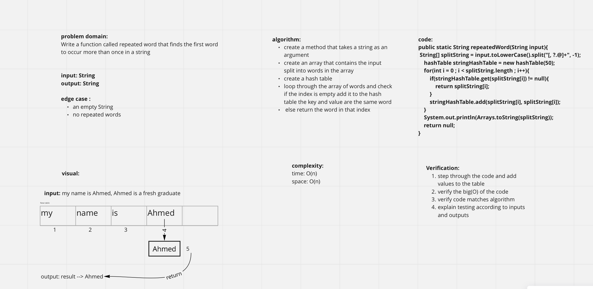

# Hashtables

A data structure that implements an associative array abstract data type, a structure that can map keys to values. A hash table uses a hash function to compute an index, also called a hash code, into an array of buckets or slots, from which the desired value can be found.

## Challenge

Implement a Hashtable Class with the following methods:

- add
  - Arguments: key, value
  - Returns: nothing
  - This method should hash the key, and add the key and value pair to the table, handling collisions as needed.
- get
  - Arguments: key
  - Returns: Value associated with that key in the table
- contains
  - Arguments: key
  - Returns: Boolean, indicating if the key exists in the table already.
- hash
  - Arguments: key
  - Returns: Index in the collection for that key

## Approach & Efficiency

Big O space/time: O(1)

## API

have an add function to added the value in the array

have a contain to check if the key is available or not

have a get function to get the value of index

have a hash function to return the place of key for index size

# Challenge 31: Repeated Words

<!-- Description of the challenge -->
Write a function called repeated word that finds the first word to occur more than once in a string

## Whiteboard Process
<!-- Embedded whiteboard image -->

## Approach & Efficiency

Time & Space Complexity: O(n)

## Solution
<!-- Show how to run your code, and examples of it in action -->
- create a method that takes a string as an argument
- create an array that contains the input split into words in the array
- create a hash table
- loop through the array of words and check if the index is empty add it to the hash table the key and value are the same word
- else return the word in that index
