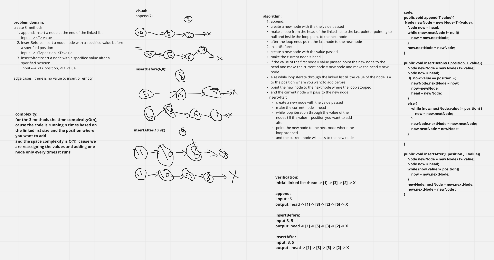

# Singly Linked List

The singly linked list is a linear data structure in which each element of the list contains a pointer which points to the next element in the list. Each element in the singly linked list is called a node. Each node has two components: data and a pointer next which points to the next node in the list

## Challenge

- create a Node class
- create a LinkedList class
- create three methods 
- 1. insert method 
- 2. include method 
- 3. toString method 

## Approach & Efficiency

| method       | Time complexity  | Space complexity |
| :---        |    :----:   | ---: |
|insert method|O(1)|O(1)|
|include method|O(n)|O(1)|
|toString method|O(n)|O(n)|

## API
<!-- Description of each method publicly available to your Linked List -->
1. insert method : to insert a node to the linked list
2. include method : to check whether the value given is indicated as a node in linked list
3. toString method :  representing all the values in the Linked List

# Challenge Summary

create 3 methods
1. append: insert a node at the end of the linked list
   - input --> <T> value
2. insertBefore: insert a node node with a specified value before a specified position                  
   - input---> <T>position, <T>value
3. insertAfter:insert a node with a specified value after a specified position
   - input ---> <T> position, <T> value

## Whiteboard Process

## Approach & Efficiency

complexity:  
for the 3 methods the time complexityO(n), cause the code is running n times based on the linked list size and the position where you want to add
and the space complexity is O(1), cause we are reassigning the values and adding one node only every times it runs

## Solution

1. create a new linked list 
2. call the method using the instance 

initial linked list :head -> [1] -> [3] -> [2] -> X  

append:  
 input : 5  
output: head -> [1] -> [3] -> [2] -> [5] -> X

insertBefore:  
input:3, 5  
output: head -> [1] -> [5] -> [3] -> [2] -> X

insertAfter:  
input: 3, 5  
output : head -> [1] -> [3] -> [5] -> [2] -> X
