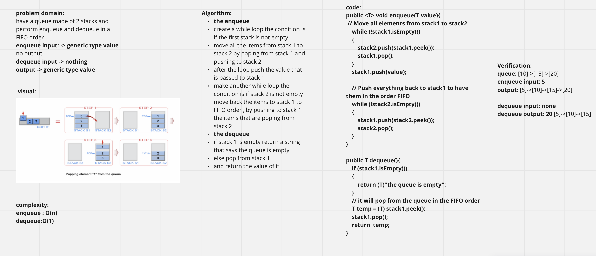
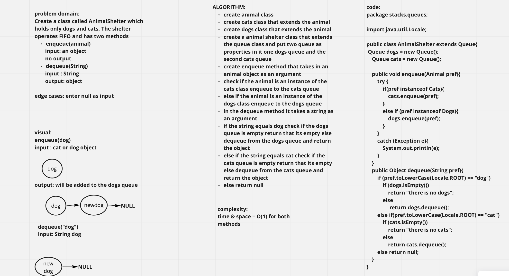
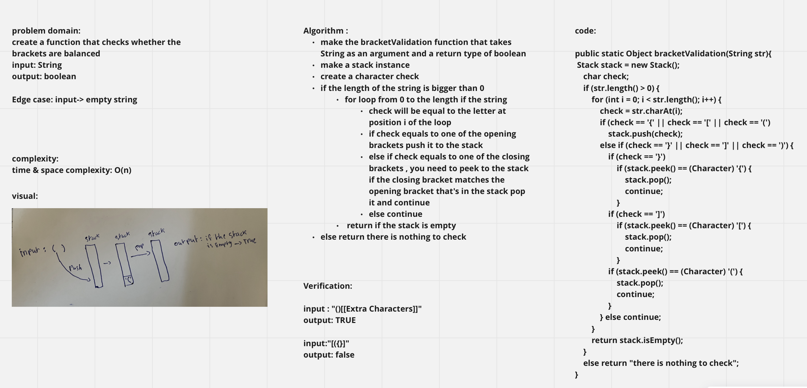

# Stack & Queues

**Stack**: A stack is a data structure that consists of Nodes. Each Node references the next Node in the stack, but does not reference its previous.

Stacks follow these concepts:

- FILO(First In Last Out)
- LIFO(Last In First Out)

**Queue**  
Queues follow these concepts:

- FIFO(First In First Out)
- LILO(Last In Last Out)

## Challenge
<!-- Description of the challenge -->
write functions for the Stack class:  
- push
- pop
- peek
- isEmpty  

and function for the Queue class:  

- enqueue
- dequeue
- peek
- isEmpty

## Approach & Efficiency
Time complexity for all the functions is :**O(1)**  
Space complexity: **O(1)**
## API

- Push: add a node to the stack with a value passed to it in the begining of the stack
- pop: delete a node from the stack from the place it adds the nodes
- enqueue: add a node to the queue with a value passed to it in the end of the queue
- dequeue: delete a node from the begining of the queue 
- peek: return the value of the next node on the stack or queue
- isEmpty: check wheather the stack or queue is empty

# Challenge Summary
have a queue made of 2 stacks and perform enqueue and dequeue in a FIFO order.

## Whiteboard Process

## Approach & Efficiency
complexity:  
enqueue : O(n)  
dequeue:O(1)  

## Solution
Verification:
queue: [10]->[15]->[20]  
enqueue input: 5  
output: [5]->[10]->[15]->[20]  

dequeue input: none   
dequeue output: 20 [5]->[10]->[15] 

# Challenge Summary

Create a class called AnimalShelter which holds only dogs and cats, The shelter operates FIFO and has two methods  
enqueue(animal)   
  input: an object  
  no output  
dequeue(String)  
  input : String  
  output: object  

## Whiteboard Process

## Approach & Efficiency

complexity:  
time & space = O(1) for both methods

## Solution

- create animal class
- create cats class that extends the animal
- create dogs class that extends the animal
- create a animal shelter class that extends the queue class and put two queue as properties in it one dogs queue and the second cats queue
- create enqueue method that takes in an animal object as an argument 
- check if the animal is an instance of the cats class enqueue to the cats queue
- else if the animal is an instance of the dogs class enqueue to the dogs queue
- in the dequeue method it takes a string as an argument
- if the string equals dog check if the dogs queue is empty return that its empty else dequeue from the dogs queue and return the object
- else if the string equals cat check if the cats queue is empty return that its empty else dequeue from the cats queue and return the object
- else return null

# Challenge Summary

create a function that checks whether the brackets are balanced  
input: String  
output: boolean  

## Whiteboard Process

## Approach & Efficiency

complexity:  
time & space complexity: O(n)

## Solution

Verification:

input : "()[[Extra Characters]]"  
output: TRUE  

input:"[({}]"  
output: false  
