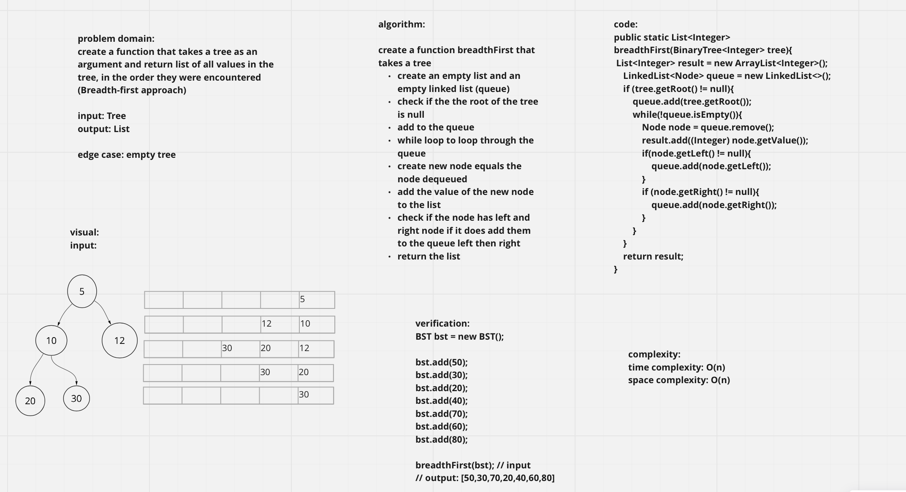
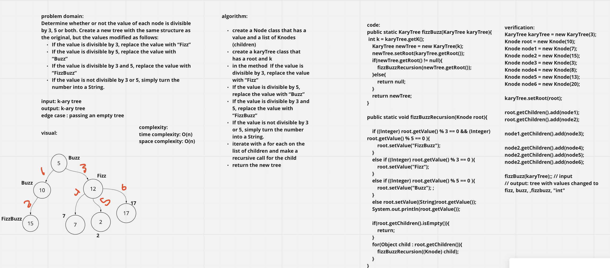

# Trees

trees consist of:  
- Node - A Tree node is a component which may contain it’s own values, and references to other nodes
- Root - The root is the node at the beginning of the tree
- K - A number that specifies the maximum number of children any node may have in a k-ary tree. In a binary tree, k = 2.
- Left - A reference to one child node, in a binary tree
- Right - A reference to the other child node, in a binary tree
- Edge - The edge in a tree is the link between a parent and child node
- Leaf - A leaf is a node that does not have any children
- Height - The height of a tree is the number of edges from the root to the furthest leaf


## Challenge

create a binary tree class , a Node class , and a BST that extends the binary tree class that has 2 methods :  
1. add
2. contains

## Approach & Efficiency

**Complexity:**  
Time & Space complexity: O(n)

## API

- add method: takes a value as an argument, the value will be checked if its bigger than the root it will be stored in the right sub tree of the root and if it was less than the root it will be stored in left.  
- contains method: takes a value as an argument and it will check whether this value is in the tree or not and return a boolean

# Challenge Summary

create a function that returns the maximum value in the tree  
input: Tree  
output: Integer  

## Whiteboard Process


## Approach & Efficiency

complexity:  
time complexity: O(n)  
space complexity: O(n)  

## Solution

verification:  

```java
BST bst = new BST();  

bst.add(50);  
bst.add(30);  
bst.add(20);  
bst.add(40);  
bst.add(70);  
bst.add(60);  
bst.add(80);  

bst.getMaxValue(); // input  
// output: 80
```

# Challenge Summary

create a function that takes a tree as an argument and return list of all values in the tree, in the order they were encountered (Breadth-first approach)

input: Tree  
output: List   


## Whiteboard Process



## Approach & Efficiency

complexity:  
time complexity: O(n)  
space complexity: O(n)  

## Solution

```java
BST bst = new BST();

bst.add(50);
bst.add(30);
bst.add(20);
bst.add(40);
bst.add(70);
bst.add(60);
bst.add(80);

breadthFirst(bst); // input
// output: [50,30,70,20,40,60,80]
```

# Challenge Summary

Determine whether or not the value of each node is divisible by 3, 5 or both. Create a new tree with the same structure as the original, but the values modified as follows:  
- If the value is divisible by 3, replace the value with “Fizz”
- If the value is divisible by 5, replace the value with “Buzz”
- If the value is divisible by 3 and 5, replace the value with “FizzBuzz”
- If the value is not divisible by 3 or 5, simply turn the number into a String.

input: k-ary tree  
output: k-ary tree   


## Whiteboard Process



## Approach & Efficiency

complexity:  
time complexity: O(n)  
space complexity: O(n)  

## Solution

```java
KaryTree karyTree = new KaryTree(3);
Knode root = new Knode(10);
Knode node1 = new Knode(7);
Knode node2 = new Knode(15);
Knode node3 = new Knode(3);
Knode node4 = new Knode(8);
Knode node5 = new Knode(13);
Knode node6 = new Knode(20);

karyTree.setRoot(root);

root.getChildren().add(node1);
root.getChildren().add(node2);

node1.getChildren().add(node3);

node2.getChildren().add(node4);
node2.getChildren().add(node5);
node2.getChildren().add(node6);

fizzBuzz(karyTree);; // input
// output: tree with values changed to fizz, buzz, ,fizzbuzz, "int"
```

